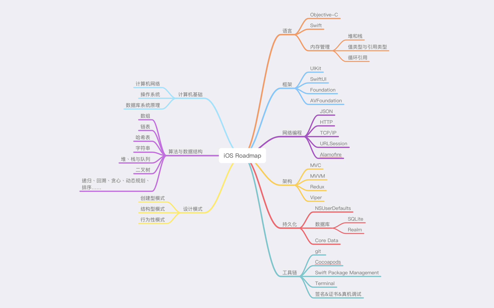

### Roadmap

* [设计模式](https://refactoringguru.cn/design-patterns)

  * [设计原则](Others/DesignPrinciples.md)

  * [HEAD FIRST 设计模式 源码OC版](HeadFirstDesignPatternsOC)

    * [策略模式](HeadFirstDesignPatternsOC/StrategyPattern)

    * [观察者模式](HeadFirstDesignPatternsOC/ObserverPattern)

    * [装饰器模式](HeadFirstDesignPatternsOC/DecoratorPattern)

    * [工厂模式](HeadFirstDesignPatternsOC/FactoryPattern)

    * [单例模式](HeadFirstDesignPatternsOC/SingletonPattern)

    * [命令模式](HeadFirstDesignPatternsOC/CommandPattern)

    * [适配器模式](HeadFirstDesignPatternsOC/AdapterPattern)

    * [外观模式](HeadFirstDesignPatternsOC/FacadePattern)

    * [模版模式](HeadFirstDesignPatternsOC/TemplatePattern)

    * [迭代器模式](HeadFirstDesignPatternsOC/IteratorPattern)

    * [组合模式](HeadFirstDesignPatternsOC/CompositePattern)
    
  * [HEAD FIRST 设计模式 源码Java版](HeadFirstDesignPatternsJava)

#### 语言

* [Objective C](Objective-C)
  
  * [Google Objective-C Style Guide](https://zh-google-styleguide.readthedocs.io/en/latest/google-objc-styleguide/contents/)

* Swift

  * [异步与并发](https://juejin.cn/post/7091099801668255774)

* 内存管理

  * [堆和栈](MemoryManagement/Heap&Stack.md)

  * [值类型与引用类型](https://blog.csdn.net/LiqunZhang/article/details/115227999)

  * [循环引用](https://zhuanlan.zhihu.com/p/22299084?from=from_parent_mindnote)

#### 框架

  * UIKit

  * SwiftUI

  * Foundation

  * AVFoundation

#### 网络编程

  * JSON

  * HTTP

  * TCP/IP

  * URLSession

  * [Alamofire](https://github.com/Alamofire/Alamofire)

#### 架构

  * MVC

  * MVVM

  * Redux

#### 持久化

  * NSUserDefaults

  * CoreData

  * 数据库

    * SQLite

    * Realm

#### 工具链

  * [Git](ToolChain/learngit.md)

  * CocoaPods

    * [解决CocoaPods 安装依赖极慢，超时崩溃方法](https://github.com/yangjunning/issues/issues/216#issue-932307978)

  * SwiftPackageManagement
    * [Xcode设置SPM代理](https://www.bolee.fun/xcode-spm-with-proxy.html)

  * Terminal

  * [签名&证书&真机调试](https://developer.apple.com/cn/support/code-signing/)

#### 其他

* [形参和实参的区别](Others/Arguments&Parameters.md)

* 学习资料

  * [iOS Zen](https://github.com/100mango/zen)

  * [Objective-C 编程](Objective-C/Objective-C编程第2版.pdf)

  * [Swift 进阶](https://objccn.io/products/advanced-swift/)

  * [SwiftUI Apple官方教程](https://developer.apple.com/tutorials/swiftui)

  * [HEAD FIRST 设计模式](Others/HEAD_FIRST设计模式.pdf)

  * [廖雪峰的网站](https://www.liaoxuefeng.com)

#### 持续更新...
