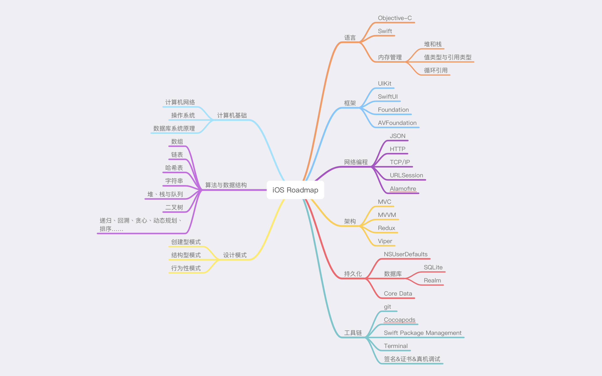

### Roadmap

#### 计算机基础

* [设计模式](https://refactoringguru.cn/design-patterns)
#### 语言

* [Objective C](Objective-C)
  
  * [Google Objective-C Style Guide](https://zh-google-styleguide.readthedocs.io/en/latest/google-objc-styleguide/contents/)

* Swift

  * [异步与并发](https://juejin.cn/post/7091099801668255774)

* 内存管理

  * [堆和栈](MemoryManagement/Heap&Stack.md)

  * [值类型与引用类型](https://blog.csdn.net/LiqunZhang/article/details/115227999)

  * [循环引用](https://zhuanlan.zhihu.com/p/22299084?from=from_parent_mindnote)

* 框架

  * UIKit

  * SwiftUI

  * Foundation

  * AVFoundation

* 网络编程

  * JSON

  * HTTP

  * TCP/IP

  * URLSession

  * [Alamofire](https://github.com/Alamofire/Alamofire)

* 架构

  * MVC

  * MVVM

  * Redux

* 持久化

  * NSUserDefaults

  * CoreData

  * 数据库

    * SQLite

    * Realm

* 工具链
  * Git

  * CocoaPods

  * SwiftPackageManagement

  * Terminal

  * [签名&证书&真机调试](https://developer.apple.com/cn/support/code-signing/)

#### 其他

* [形参和实参的区别](Others/Arguments&Parameters.md)

* 学习资料

  * [Objective-C 编程](Objective-C/Objective-C编程第2版.pdf)

  * [Swift 进阶](https://objccn.io/products/advanced-swift/)

  * [SwiftUI Apple官方教程](https://developer.apple.com/tutorials/swiftui)

  * [HEAD FIRST 设计模式](Others/HEAD_FIRST设计模式.pdf)

#### 持续更新...
